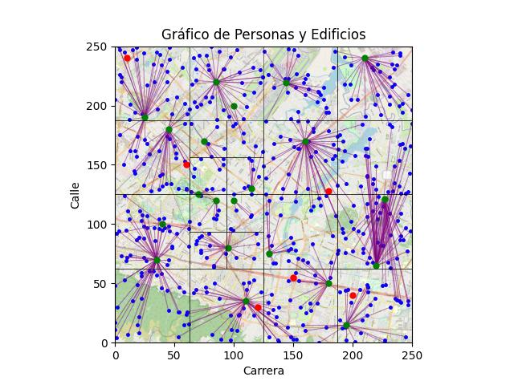

# Proyecto de Organización de Puntos con Quadtree

Este proyecto tiene como objetivo la organización de una serie de puntos en una cuadrícula de 250x250 que representa las calles y carreras de una región de Bogotá. Utilizaremos un Quadtree para lograr una estructura eficiente de almacenamiento y búsqueda de los puntos en esta región.

## Descripción del Proyecto

El Quadtree es una estructura de datos jerárquica que divide el espacio en cuatro subregiones en cada nivel. En nuestro caso, cada nodo del Quadtree representará una región de la cuadrícula y contendrá información sobre los puntos dentro de esa región. Esto permitirá una búsqueda eficiente de puntos en la cuadrícula.

## Análisis de Complejidad :
**InsertarEdificio:** Tiene una complejidad de tiempo lineal, O(n), donde n es la cantidad de edificios en el cuadrante actual. Esto se debe a que la función crea cuatro nuevos cuadrantes y luego itera sobre los edificios del cuadrante actual para asignarlos a los cuadrantes correspondientes. En el peor caso, cuando todos los edificios se encuentran en el mismo cuadrante, la función debe iterar sobre todos los edificios una vez, lo que resulta en una complejidad lineal. Sin embargo, en general, se espera que la cantidad de edificios se distribuya de manera más uniforme entre los cuadrantes, lo que podría reducir la cantidad de iteraciones requeridas y mejorar la eficiencia del algoritmo.

**InsertarEdificio:** En el caso promedio, donde la distribución de edificios es uniforme, la función tiene una complejidad de tiempo logarítmica, O(log n), donde n es el número total de edificios en el árbol. Esto se debe a que la función realiza una búsqueda descendente en el árbol para encontrar el cuadrante adecuado donde insertar el edificio. Cada nivel del árbol reduce a un cuarto el número de nodos a considerar, lo que resulta en una búsqueda eficiente a medida que desciende por el árbol.

Sin embargo, en el peor caso, cuando el árbol está desbalanceado y todos los edificios se encuentran en un solo cuadrante, la función debe iterar sobre todos los edificios en el árbol, lo que resulta en una complejidad de tiempo lineal, O(n). Esto puede ocurrir si los edificios se encuentran cerca uno del otro o si se insertan en orden de manera que todos terminen en el mismo subárbol.

**InsertarEstuadiante:** La función insertarEstudiante también tiene una complejidad de tiempo logarítmica o lineal, al igual que la función insertarEdificio.

En el caso promedio, donde la distribución de edificios en el arbol es uniforme, la función tiene una complejidad de tiempo logarítmica, O(log n), donde n es el número total de edificios en el árbol. Esto se debe a que la función realiza una búsqueda descendente en el árbol para encontrar el edificio más cercano con espacio disponible para el estudiante. Al igual que en la función insertarEdificio, cada nivel del árbol reduce a la mitad el número de nodos a considerar, lo que resulta en una búsqueda eficiente a medida que desciende por el árbol.

Sin embargo, en el peor caso, donde el árbol está desbalanceado y todos los edificios se encuentran en un solo cuadrante, o si el estudiante intenta ingresar repetidamente y no hay espacio disponible, la función puede tener una complejidad de tiempo lineal, O(n), donde n es el número total de edificios en el árbol. Esto ocurre cuando todos los edificios deben ser inspeccionados para encontrar el más cercano con espacio, y se realiza en el peor de los casos o en situaciones no ideales.

**verificarEdificiosDisponibles:**La función verificarEdificiosDisponibles tiene una complejidad de tiempo lineal, O(n), donde n es el número de edificios en el cuadrante actual y como incialmente se plantea que por cuadrante solo hay 2 edificios máximos el peór caso sera de O(2) osea constante. La función itera sobre todos los edificios en el cuadrante y verifica si cada edificio está disponible o no. En el peor caso, donde todos los edificios deben ser verificados, la función debe realizar un número de operaciones proporcional a la cantidad de edificios en el cuadrante, lo que resulta en una complejidad lineal.

**asignarSalones:** La función asignarSalones tiene una complejidad de tiempo que depende del número de salones y estudiantes en un edificio específico. Si consideramos el número de estudiantes como n, entonces la complejidad de tiempo sería O(n) o lineal teniendo en cuenta que el recorrido que se realizara irá asignando a cada estudiante a un salón.

**acomodarEdificios:** La función acomodarEdificios tiene una complejidad de tiempo lineal, O(n), donde n es el número de edificios en el cuadrante.

La función itera sobre todos los edificios en el cuadrante y realiza ajustes en la cantidad de estudiantes en cada edificio para cumplir con las capacidades mínimas o óptimas. En el peor caso, donde todos los edificios deben ser ajustados, la función realiza un número de operaciones proporcional al número de edificios en el cuadrante, lo que resulta en una complejidad lineal.

**acomodarDesdeHoja:** La función acomodarDesdeHoja tiene una complejidad de tiempo lineal, O(n), donde n es el número total de edificios en el árbol.

La función itera sobre los nodos del árbol, comenzando desde las hojas y avanzando hacia la raíz. En cada nodo, llama a la función acomodarEdificios para ajustar los edificios en ese nodo en particular.

Dado que la función recorre todos los nodos del árbol, en el peor caso, donde todos los edificios en el árbol deben ser ajustados, realiza un número de operaciones proporcional al número total de edificios en el árbol, lo que resulta en una complejidad lineal.

### Funcionalidades del Proyecto

1. **Inserción de Puntos:** Los usuarios podrán insertar puntos en la cuadrícula, y el Quadtree se encargará de organizarlos en las regiones correspondientes.

2. **Búsqueda de Puntos:** Se podrá buscar puntos en una región específica de la cuadrícula de manera rápida gracias al Quadtree.

3. **Visualización del Mapa:** Los usuarios podrán ver una representación gráfica de la cuadrícula con los puntos y divisiones del Quadtree.

### Visualizacion del mapa 
