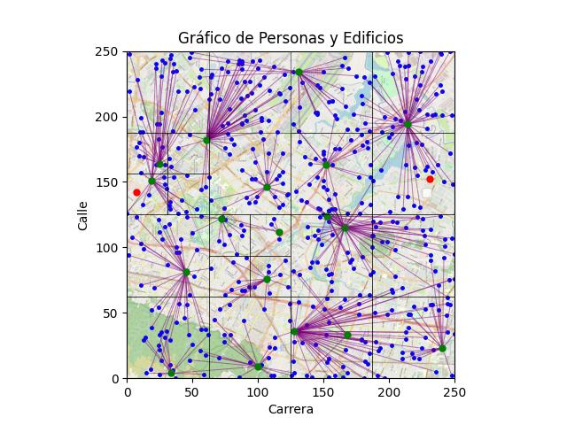

# Proyecto de Organización de Puntos con Quadtree

This project utilizes a Quadtree on a 250x250 grid to organize points representing streets in Bogotá. It aims to efficiently assign rooms to students for national exams, ensuring they are placed in the nearest room based on their location.

## Project Description

The Quadtree is a hierarchical data structure that divides space into four subregions at each level. In our case, each Quadtree node will represent a region of the grid and contain information about the points within that region. This will allow for efficient point search within the grid.

## Complexity Analysis:

- **InsertBuilding:** It has a linear time complexity, O(n), where n is the number of buildings in the current quadrant. This is because the function creates four new quadrants and then iterates over the buildings in the current quadrant to assign them to the corresponding quadrants. In the worst case, when all buildings are in the same quadrant, the function must iterate over all buildings once, resulting in linear complexity. However, in general, the number of buildings is expected to be more evenly distributed among the quadrants, which could reduce the number of required iterations and improve the algorithm's efficiency.

- **InsertStudent:** The insertStudent function also has logarithmic or linear time complexity, similar to the insertBuilding function.

In the average case, where the distribution of buildings in the tree is uniform, the function has a logarithmic time complexity, O(log n), where n is the total number of buildings in the tree. This is because the function performs a downward search in the tree to find the nearest building with available space for the student. Similar to the insertBuilding function, each level of the tree halves the number of nodes to consider, resulting in an efficient search as it descends the tree.

However, in the worst case, where the tree is unbalanced and all buildings are in a single quadrant, or if the student attempts to enter repeatedly and there is no available space, the function may have linear time complexity, O(n), where n is the total number of buildings in the tree. This occurs when all buildings must be inspected to find the nearest one with space and occurs in the worst-case scenario or in non-ideal situations.

- **checkAvailableBuildings:** The checkAvailableBuildings function has linear time complexity, O(n), where n is the number of buildings in the current quadrant. As initially stated, for each quadrant, there are only 2 maximum buildings, so the worst case will be O(2), which is constant. The function iterates over all the buildings in the quadrant and checks whether each building is available or not. In the worst case, where all buildings must be checked, the function must perform a number of operations proportional to the number of buildings in the quadrant, resulting in linear complexity.

- **assignRooms:** The assignRooms function's time complexity depends on the number of rooms and students in a specific building. If we consider the number of students as n, then the time complexity would be O(n) or linear considering that the traversal will assign each student to a room.

- **adjustBuildings:** The adjustBuildings function has linear time complexity, O(n), where n is the number of buildings in the quadrant.

The function iterates over all the buildings in the quadrant and makes adjustments to the number of students in each building to meet the minimum or optimal capacities. In the worst case, where all buildings must be adjusted, the function performs a number of operations proportional to the number of buildings in the quadrant, resulting in linear complexity.

- **adjustFromLeaf:** The adjustFromLeaf function has linear time complexity, O(n), where n is the total number of buildings in the tree.

The function iterates over the nodes of the tree, starting from the leaves and moving towards the root. At each node, it calls the adjustBuildings function to adjust the buildings in that particular node.

Since the function traverses all the nodes of the tree, in the worst case, where all the buildings in the tree must be adjusted, it performs a number of operations proportional to the total number of buildings in the tree, resulting in linear complexity.

## Project Functionalities

1. **Point Insertion:** Users can insert points on the grid, and the Quadtree will organize them into corresponding regions.

2. **Point Search:** Points can be searched for in a specific region of the grid quickly thanks to the Quadtree.

3. **Map Visualization:** Users can view a graphical representation of the grid with points and Quadtree divisions.

### Map Visualization

